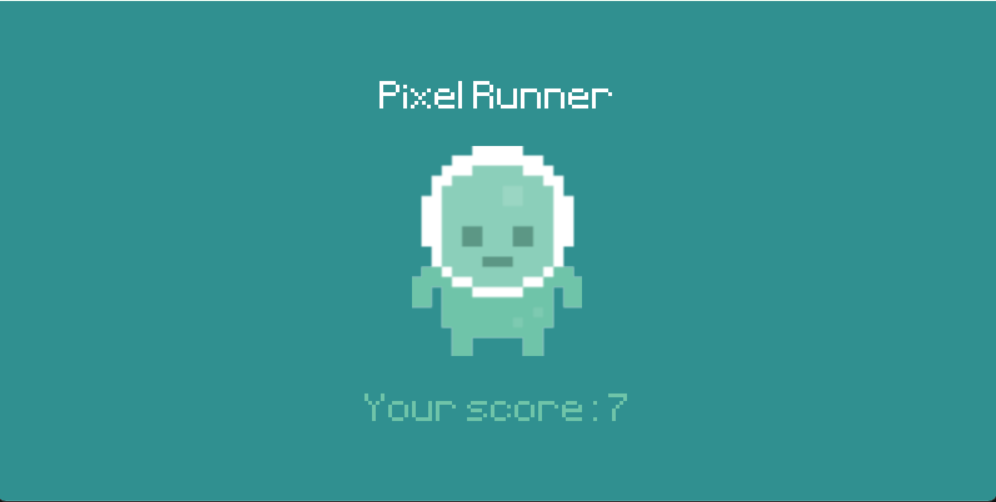

# 🎮 Pixel Runner

  
  <br/>

**Pixel Runner** is a fun, fast-paced endless runner game built using **Python** and **Pygame**. Your goal is simple: avoid incoming obstacles, survive as long as you can, and earn the highest score possible.

With animated sprites, background music, and smooth jump mechanics, Pixel Runner is a great small game project demonstrating fundamental 2D game development concepts.

---

## 🖼️ Screenshots

<p align="center">
  
  <br/>
  <em>Jump to dodge snails and flying bugs!</em>
</p>

---

## 📦 Features

- 🏃‍♂️ Player character with animated walking and jumping
- 🐌 Two types of obstacles (ground and flying)
- 🧠 Simple collision detection
- 🎵 Background music and jump sound effect
- ⏱️ Real-time score tracking
- 🖥️ Start & game over screens


 
---

## 🚀 How to Run the Game

### 1. Clone this repository:
```bash
git clone https://github.com/amrrr2/RunnerGame.git
cd RunnerGame
